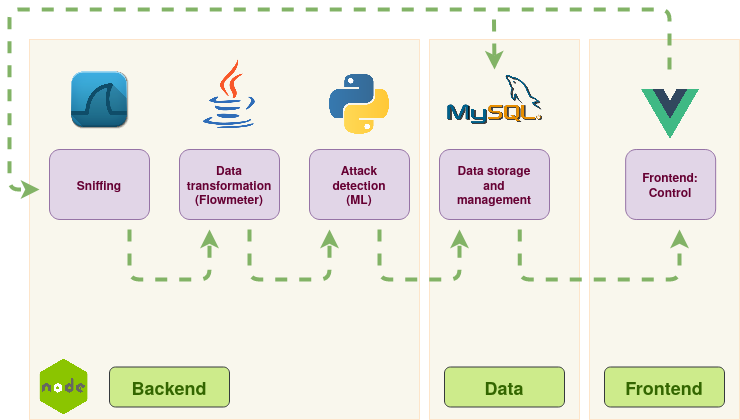
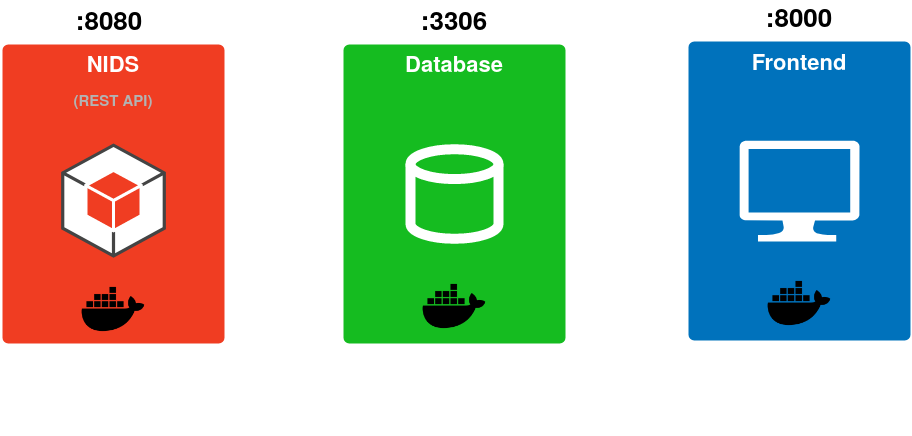

[Home](https://nagomez97.github.io/ML-NIDS/)

# INDEX
1. [Introduction](documentation.md)
2. [Deployment](deployment.md)
3. [Design](design.md)
4. [Sniffer](sniffer.md)
5. [FlowMeter](flowmeter.md)
6. [Security](security.md)

---

# Design
This section contains information about the Vision design. We will talk about the application modules, Docker and the technology used at development.

## Classes
As Vision is a quite simple application, it has few classes. The next image shows them.

## Modules
Vision has three main modules which correspond to the three containers.

The **Backend** module is responsible for the network sniffing, data transformation and attack detection functionalities, while it manages the NIDS API.

The **Data** module includes the MySQL database and every related functionality.

The **Frontend** module refers to the web server functionality. The frontend has been developed using VueJS.

## Technology
As the application includes a wide range of functionalities, many different technologies has been used during its development.

The **Backend** has been written using **NodeJS**, but it also includes **Java** code (Flowmeter) and **Python** (ML functionalities).

The **Frontend** server has been developed using **NodeJS**, while the web GUI includes **VueJS** components.

The **Data Layer** is composed by a **MySQL** database and an NodeJS-ORM called **Sequelize**.

## API
Actually, there are two APIs, each of them inside its own container. The main API is called NIDS and it includes the proper backend functionality, while the Frontend API is the responsible for the web server management.

