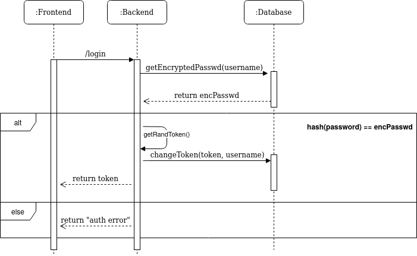

[Home](https://nagomez97.github.io/ML-NIDS/)

# INDEX
1. [Introduction](documentation.md)
2. [Deployment](deployment.md)
3. [Design](design.md)
4. [Sniffer](sniffer.md)
5. [FlowMeter](flowmeter.md)
6. [Security](security.md)

---

# Security
Security is a main topic when talking about Vision. The application has access to some sensible data, so it must be strongly secured.

The NIDS API has a *bearer token* authentication layer, so only authenticated users can conssume the API. Every *token* is valid only for one session and will never be reused. *Tokens* are created using the function *randomBytes(64)* every time a user logs in. The following picture shows the *token* authentication procedure.

Vision allows the creation of **only one user**, wich will be the IDS administrator. Its credentials will be created the first time the application has been launched. At every moment, password are stored as *hashes* using the *bcrypt* algorithm.

The NIDS API and the web server have SSL certificates to allow HTTPS traffic. Please, generate your own certificates and save them on *NIDS/src/certs/*.